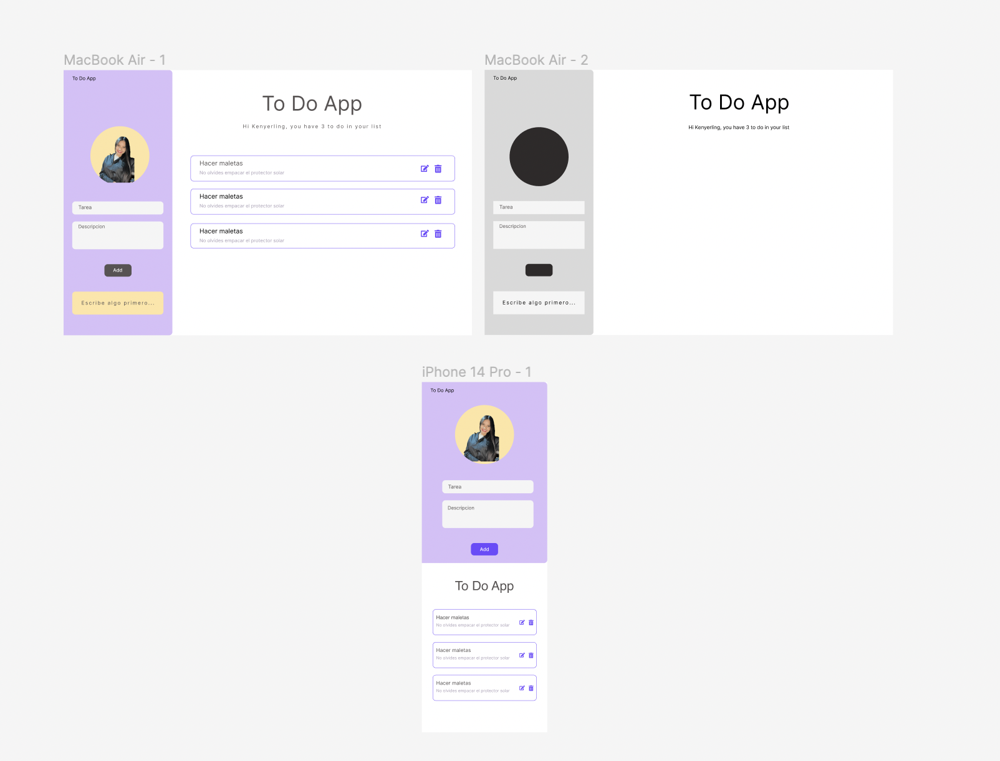

DEMO ----- https://kenpaolarod.github.io/crud-app/

My  to-do list app using HTML, CSS, and JavaScript. In this web app you can create, read, update, and delete tasks easily.

My to-do app let you sort your daily tasks. It saves them in the browser for simple access and tracking, even after you close the window.

 This project not only allowed me to improve my web development skills but also provided me with an effective personal tool to stay organized in my daily tasksEste Proyecto es una Crud app presonal para organizar mi dia a dia alli.

